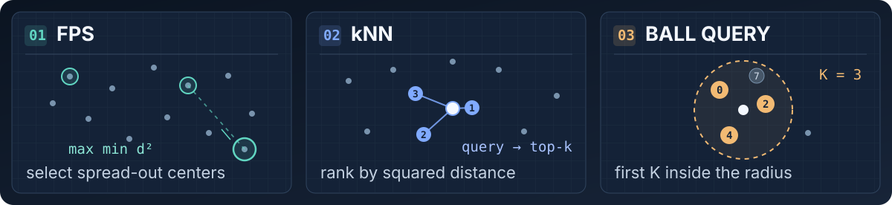
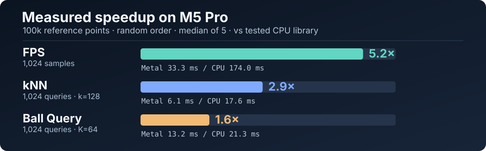

<h1 align="center"> mps-pointops</h1>

<p align="center">
  <a href="https://github.com/gamzerA/mps-pointops/actions/workflows/ci.yml"></a>
  <a href="https://doi.org/10.5281/zenodo.23076057"></a>
  <a href="https://pypi.org/project/mps-pointops/"></a>
  <a href="https://pypistats.com/packages/mps-pointops"></a>
  <a href="#quick-start"></a>
  <a href="#quick-start"></a>
  <a href="#license"></a>
</p>

**Point-cloud operators for PyTorch on Apple Silicon.** Native Metal kernels
run farthest point sampling, k nearest neighbors, and Ball Query on MPS.
Version 0.5.0 also provides experimental PointNet++ feature propagation and
squared-L2 Chamfer distance APIs.
Compatibility stand-ins cover supported `pointnet2_ops`, `knn_cuda`, and
`torch_cluster` call sites; CPU tensors use PyTorch reference implementations.

<p align="center">
  
</p>

[Quick start](#quick-start) · [Results](#benchmark) ·
[Equations](#the-operators-in-equations) · [Compatibility](#compatibility) ·
[Numerical contract](docs/ball-query-math.md) · [Citation](#citation)

## Quick start

Native Metal execution requires an Apple Silicon Mac, Python 3.10 or later,
PyTorch 2.7 or later, and an available MPS device. On other systems the package
can be installed and CPU tensors use the PyTorch reference implementations;
requesting an unavailable MPS device does not silently switch to CPU. The Metal
kernels compile on first use.

### Install

```bash
python -m pip install mps-pointops
```

Version 0.5.0 includes dense SIMD Ball Query, the PyTorch3D-style Ball Query
adapter, and the large-cloud FPS path for a single cloud. It adds experimental
`three_nn`, `three_interpolate`, and squared-L2 `chamfer_distance` APIs. Their
supported inputs and differences from upstream are specified in the
[PointNet++ propagation](docs/pointnet2-propagation.md) and
[Chamfer](docs/chamfer-contract.md) contracts.
Direct comparisons against the
[original PointNet++ CUDA extension](docs/parity/pointnet2-upstream.md) and
[PyTorch3D Chamfer](docs/chamfer-upstream-parity-0.5.0.md) record the tested
inputs, output and gradient errors, build adjustments, and source hashes.

### Minimal example

```python
import torch
from mps_pointops import ball_query, furthest_point_sample, knn

if not torch.backends.mps.is_available():
    raise SystemExit("PyTorch MPS is unavailable; use CPU tensors for the reference path")

xyz = torch.tensor(
    [[[0., 0., 0.], [1., 0., 0.], [0., 1., 0.], [1., 1., 0.]]],
    device="mps",
)
centers_idx = furthest_point_sample(xyz, 2, start_idx=0)
centers = xyz.gather(1, centers_idx[..., None].expand(-1, -1, 3))
distance, neighbor_idx = knn(centers, xyz, 2)
distance2, radius_idx = ball_query(centers, xyz, 1.1, 2)

assert centers_idx.tolist() == [[0, 3]]
assert neighbor_idx.tolist() == [[[0, 1], [3, 1]]]
assert radius_idx.tolist() == [[[0, 1], [1, 2]]]
print("MPS point ops OK")
```

The experimental 0.5.0 operators can be called directly:

```python
import torch
from mps_pointops import chamfer_distance, three_interpolate, three_nn

xyz = torch.tensor(
    [[[0., 0., 0.], [1., 0., 0.], [0., 1., 0.]]], device="mps"
)
distances, indices = three_nn(xyz[:, :2], xyz[:, :3])
weights = torch.full_like(distances, 1.0 / 3.0)
features = torch.ones((1, 2, 3), device="mps", requires_grad=True)
interpolated = three_interpolate(features, indices, weights)
loss, _ = chamfer_distance(xyz[:, :2], xyz[:, :3])
print(interpolated.shape, loss.item())
```

| Operator | Selection rule | Native result |
|:--|:--|:--|
| FPS | Farthest from the already selected centers | `int64` center indices |
| kNN | Nearest `k`, sorted by squared distance then index | Euclidean distances, `int64` indices |
| Ball Query | First `K` inside a strict radius, in input order | Squared distances, `int64` indices; `-1` padding |

For a query $q_i$ and reference point $x_j$, the shared distance is
$s_{ij}=\sum_{d=0}^{2}(q_{id}-x_{jd})^2$; each operator selects indices by a
different rule. [The equations](#the-operators-in-equations) give the full
selection and gradient formulas. On MPS, Ball Query supports coordinate
gradients for its squared distances; FPS and kNN do not implement backward.

**Current source measured on one M5 Pro, with 100k randomly ordered reference points:**
FPS **6.5×**, kNN **4.2×**, and dense Ball Query **13.7×** faster than the
fastest tested CPU library for each operation. With spatially sorted points,
dense Ball Query measured **2.9 ms** versus SciPy's **20.6 ms**. The
[benchmark](#benchmark) states the setup and links the raw results and source
hashes. The [PyTorch3D-style adapter](#pytorch3d-style-ball-query) is available
separately from the timed dense API.

For existing CUDA-oriented imports, call `mps_pointops.compat.install()`
*before* importing `pointnet2_ops`, `knn_cuda`, or `torch_cluster`:

```python
import mps_pointops.compat
mps_pointops.compat.install()

from pointnet2_ops import pointnet2_utils
from knn_cuda import KNN
from torch_cluster import fps, knn as flat_knn, radius
```

The native API is dense and batched. The flat API in `mps_pointops.flat`
supports sorted batch vectors and global indices. See
[Compatibility](#compatibility) for the stand-ins' behavior and
[License](#license) for component notices.

## Why

Point-MAE based 3D anomaly detection, such as the
[MulSen-AD](https://github.com/ZZZBBBZZZ/MulSen-AD) baseline, groups points with
`pointnet2_ops.furthest_point_sample` and `knn_cuda.KNN`. Both are CUDA only, so
the code does not run on a Mac at all. The usual workaround is to rewrite them
in plain PyTorch and run on MPS. That works, but it is slow, and a 48 GB M5 Pro
ends up slower than its own CPU.

The goal of this project is drop-in Metal kernels for these ops that beat the
best CPU implementations on the same machine.

## Real data: a MulSen-AD 3D detector gives the same results as on CUDA

The Point-MAE 3D-only anomaly detector from the MulSen-AD baseline (MulSen-AD's
released feature extractor, coreset memory bank and object score) was fit and
scored on the Mac GPU with `compat.install()` providing `pointnet2_ops` and
`knn_cuda`, and compared with the same runs made earlier on CUDA with the real
extensions (Windows, RTX 2080, PyTorch 2.9.1 + CUDA 13).

- 45 runs: 15 MulSen-AD categories x 3 seeds, fit on normal samples of a
  frozen research split and scored on its validation samples. The same sample
  IDs and labels were used on both machines.
- Object AUROC, object AP, 3D-label AUROC and 3D-label AP: identical to the
  CUDA runs in all 45 runs.
- Per-sample anomaly scores: largest relative difference 9.85e-5, and the same
  ranking of samples in every run.

This is a validation-set comparison from a separate research project, so the
split, scores and runner scripts are not part of this repository. Setup:
Apple M5 Pro, macOS 26.5.2, PyTorch 2.14.1, this package at commit 80bbca5.

## Real data: MulSen-AD grouping

[examples/mulsen_grouping.py](examples/mulsen_grouping.py) loads MulSen-AD
point clouds the way MulSen-AD's dataset code does (open3d, duplicate vertices
removed, centered) and runs MulSen-AD's own `models.models.Group(num_group=1024,
group_size=128)`, unmodified, on MPS with `compat.install()`.

30 clouds, 2 from each of the 15 classes, 21,168 to 117,259 points, Apple M5
Pro:

These are earlier real-data measurements, separate from the current-source
synthetic benchmark below. None of these clouds reaches the new 500,000-point
FPS automatic-switch threshold.

| | min | median | max |
|---|---:|---:|---:|
| MulSen `Group` on MPS with mps-pointops (FPS + gather + kNN + indexing) | 10.5 ms | 36.0 ms | 49.1 ms |
| Best CPU libraries (fpsample FPS + scipy cKDTree kNN, nothing else) | 40.1 ms | 163.4 ms | 221.9 ms |
| Plain PyTorch on MPS (FPS loop + `cdist`/`topk`) | 131.1 ms | 330.6 ms | 423.7 ms |

- mps-pointops is 3.0x to 5.0x faster than the CPU libraries (median 4.5x)
  and 7.6x to 13x faster than plain PyTorch on MPS (median 9.2x).
- FPS centers match the pointnet2_ops-contract reference and neighbors match
  an exact float32 oracle: 0 mismatches in all 30 clouds.
- None of these clouds has points within the near-origin cutoff that
  pointnet2_ops skips (see [Compatibility](#compatibility)), so that rule did
  not come into play here.

Per-cloud numbers: [examples/results/mulsen_grouping.json](examples/results/mulsen_grouping.json).
The full MulSen-AD pipeline also needs pretrained DINO ViT-B/8 and Point-MAE
weights and has not been run yet.

## Benchmark



The chart compares each current Metal kernel with the fastest tested CPU
library for that operation on the **same M5 Pro**. It uses batch 1, 100,000
reference points, 1,024 samples or queries, random input order, and the median
of five runs, with MPS fallback disabled and Fast Math unset. SciPy times
include KD-tree construction; device transfer is excluded. The chart is
generated from the committed
[random-order JSON](bench/results/2026-10-01-source-sync/2026-10-01-apple-m5-pro.json)
by [this script](tools/render_readme_assets.py). The JSON records SHA-256 for
the benchmark, operator dispatch, reference code, and all three timed kernels;
the hashes match the current files. The Ball Query row times the dense
`mps_pointops.ball_query` API, without the optional PyTorch3D adapter's
neighbor gathering. Displayed times are rounded to 0.1 ms; the speedups use
unrounded medians in the JSON.

The synthetic points lie near a unit sphere and use MulSen-AD scale. Full
result tables: [current random order](bench/results/2026-10-01-source-sync/2026-10-01-apple-m5-pro.md)
and [current x-sorted Ball Query](bench/results/2026-10-01-source-sync/ball-sorted-only/2026-10-01-apple-m5-pro-sorted.md).
The [v0.3.0 Ball Query results](bench/results/2026-10-01-apple-m5-pro-ball-query-port.md)
remain archived as a separate release baseline.

Current source, Apple M5 Pro, 48 GB, macOS 26.5.2, torch 2.14.1, random point order:

| op | points | **mps-pointops (Metal)** | torch on MPS | torch on CPU | best CPU library |
|---|---:|---:|---:|---:|---:|
| FPS (1024 samples) | 20,000 | **5.6 ms** | 43.1 ms | 102.0 ms | 33.1 ms (fpsample) |
| | 100,000 | **25.2 ms** | 84.7 ms | 270.6 ms | 163.7 ms (fpsample) |
| kNN (1024 queries, k=128) | 20,000 | **2.1 ms** | 9.5 ms | 10.2 ms | 4.8 ms (scipy cKDTree) |
| | 100,000 | **4.1 ms** | 70.9 ms | 38.8 ms | 17.3 ms (scipy cKDTree) |
| Ball query (1024 queries, K=64, r=0.1) | 20,000 | **1.1 ms** | 25.6 ms | 30.7 ms | 4.8 ms (scipy cKDTree) |
| | 100,000 | **1.5 ms** | 157.2 ms | 155.0 ms | 19.9 ms (scipy cKDTree) |

What this shows:

- **The Metal kernels beat the tested CPU libraries on these inputs**: FPS is
  5.9× to 6.5× faster than fpsample, kNN is 2.2× to 4.2× faster than SciPy's
  KD-tree, and Ball Query is 4.5× to 13.7× faster than SciPy including its
  tree build. Against plain PyTorch on MPS, FPS is 3.4× to 7.7× faster and
  kNN is 4.5× to 17.3× faster.
- **Plain PyTorch FPS on MPS grows much slower than the work.** 5x the points
  took it from 43.1 ms to 84.7 ms. Our hypothesis is a fixed cost per step (1024
  sequential steps of several small kernels each: dispatch, scheduling,
  synchronization). This has not been profiled. The Metal kernel runs all 1024
  steps in one dispatch.
- **Plain PyTorch kNN is not exact.** `cdist` uses a matrix multiply here, so
  distances are off by up to 4.9e-4 and 40 to 242 neighbors land in the wrong
  position; at 100k points 1 to 2 of the 131,072 true neighbors are missing.
- **Ball Query keeps input order while scanning in SIMD blocks.** At 100k
  random points it measured 1.5 ms versus SciPy's 19.9 ms including tree
  construction. With points sorted by x, the separate current-source run
  measured 2.9 ms versus SciPy's 20.6 ms. Input order still affects its
  runtime because each query stops after its first `K` hits.

Timings move by a few ms, sometimes more, between runs. Inputs are already
resident on each implementation's device; transfer time is outside the timer.
The scipy times include building the KD-tree. fpsample's QuickFPS
(`bucket_fps_kdline_sampling`) is absent because in fpsample 1.0.2 it ignores
`start_idx` and returns a different, sorted sample set.

### Dense Ball Query SIMD ablation

The current source assigns one SIMD group to each dense Ball Query and ranks
matches with an exclusive prefix scan, retaining the first `K` point indices
in input order. On the same M5 Pro, a paired Safe Math ablation compiled the
v0.3.0 dense kernel and the SIMD kernel in one process. It alternated their
execution order, used 3 warmups and 12 timed runs per kernel, and synchronized
MPS immediately before and after each dispatch. Both used resident float32
inputs, 1,024 queries, `K=64`, and `r=0.1`; allocation, transfer, and shader
compilation were outside the timer.

| Input order | Points | v0.3.0 dense median | SIMD median | Speedup |
|:--|--:|--:|--:|--:|
| x-sorted | 20,000 | 4.28 ms | 1.08 ms | 3.96× |
| x-sorted | 100,000 | 21.43 ms | 2.91 ms | 7.37× |
| random | 20,000 | 4.24 ms | 1.06 ms | 4.01× |
| random | 100,000 | 7.66 ms | 1.40 ms | 5.48× |

For those four inputs, the two kernels produced byte-identical `int64`
indices and `float32` squared distances, including padding. This is an
observed baseline-to-SIMD result, not a general promise of bitwise agreement
with a CPU implementation near floating-point boundaries. The
[paired benchmark](bench/bench_ball_query_simd_ablation.py) and
[raw results](bench/results/2026-10-01-apple-m5-pro-ball-query-simd-ablation.json)
record the source hashes, inputs, and individual timings. The chart and table
above use a new full-benchmark run of the current source. This paired ablation
isolates the old and new shader dispatches, so its timings have a different
scope and do not measure SciPy.

The new full benchmark measured the current SIMD kernel against SciPy cKDTree
build plus query: **2.9 versus 20.6 ms** on x-sorted 100k points and **1.5
versus 19.9 ms** on randomly ordered 100k points. Both runs had **0 mismatched
indices out of 65,536** against the CPU first-K reference; the largest reported
squared-distance difference was `1.9e-9`. These SciPy numbers come from the
separate [sorted](bench/results/2026-10-01-source-sync/ball-sorted-only/2026-10-01-apple-m5-pro-sorted.json)
and [random](bench/results/2026-10-01-source-sync/2026-10-01-apple-m5-pro.json)
JSON runs, not the paired old-versus-new ablation above.

For output completeness, a separate [differential checker](bench/verify_ball_query_simd_contract.py)
passed 48 Safe and 40 Fast Math cases using output buffers prefilled with
sentinel values. It compared every output byte with the previous Metal
kernel and compared first-K `int64` indices with an independent CPU oracle.
It covered both coordinate dtypes, lengths, empty references, 32-lane and
8-query dispatch boundaries, `K=1/31/33/65`, and a small-radius path. Safe
Math also included NaN and Inf inputs. Its [Safe](bench/results/2026-10-01-apple-m5-pro-ball-query-simd-contract-safe.json)
and [Fast](bench/results/2026-10-01-apple-m5-pro-ball-query-simd-contract-fast.json)
JSON files identify the exact inputs and shader hashes.

### Large single-cloud FPS path

The source tree also provides a [multi-threadgroup FPS kernel](mps_pointops/kernels/fps_multigroup.metal)
for batch size 1. It divides a cloud into 4,096-point chunks and uses a second
dispatch to reduce their partial maxima after each sampling step. The
`strategy="auto"` policy selects it only on the tested **M5 Pro** for at least
500,000 points and two samples. Other Apple GPUs and all multi-cloud batches
keep the original single-threadgroup path by default; callers can compare
`strategy="single"` and `strategy="multigroup"` on their own hardware.

The earlier [size sweep](bench/results/2026-10-01-apple-m5-pro-fps-multigroup.md)
found a crossover between 32,768 and 65,536 points on this M5 Pro. The 500,000
point automatic cutoff is deliberately above that measured crossover. A
[production-kernel spot check](bench/results/2026-10-01-apple-m5-pro-fps-production.json)
at 1,024 samples measured:

- 500,000 points: **193.08 → 29.37 ms** (6.57× faster).
- 1,000,000 points: **421.69 → 49.39 ms** (8.54× faster).

Output indices matched in every paired iteration. The recorded script,
dispatch, and FPS shader SHA-256 values match the current files. The JSON
retains the commit and dirty-tree status observed when it was measured; those
provenance fields were not rewritten after the merge. These timings include
host dispatch overhead and are bracketed by `torch.mps.synchronize()`; they
do not establish a crossover on other Apple GPUs. This FPS spot check uses
standard-normal points, while the 20k–100k chart uses synthetic sphere-shell
points, so the two timing sets should be read separately.

### Correctness checks

Each benchmark row records counts, not percentages, so a single mismatch stays
visible:

- FPS: indices that differ from the PyTorch CPU reference.
- kNN: against an exact float32 oracle (squared distances rounded like the
  kernel, sorted by distance then index): true neighbors missing, neighbors in
  the wrong position, and the largest distance error.
- Ball query: indices and squared distances that differ from the
  PyTorch3D-contract reference on CPU.

On the listed synthetic inputs, the Metal kernels had 0 index mismatches.
Ball Query's maximum squared-distance error against the separate-operation
CPU reference was 1.9e-9; FPS indices matched and kNN reported no distance
error.
These are observations on one M5 Pro, not a guarantee for every input, GPU or
compiler. The v0.4.0 release source, including the large-cloud FPS path and
PyTorch3D-style adapter, reported **201 passed, 12 skipped** in separate
[Safe](docs/pytest-fps-p3d-safe-torch214-2026-10-01.log) and
[Fast](docs/pytest-fps-p3d-fast-torch214-2026-10-01.log) processes under
PyTorch 2.14.1 with MPS fallback disabled. Seven skips are existing kNN
`k > n` cases and five are PyG 2.8 tests whose optional `pyg-lib` dependency
is absent from this local environment. The PyTorch3D adapter tests are
included in the 201 passes. Earlier test logs remain under `docs/` as
historical evidence for their respective commits.

### Run it

```bash
uv venv --python 3.12 && uv pip install torch numpy scipy fpsample pytest
PYTORCH_ENABLE_MPS_FALLBACK=0 .venv/bin/python bench/bench_pointops.py \
  --sizes 20000 100000 --ops fps knn ball_query --warmup 2 --repeat 5 \
  --order random --out bench/results/local
PYTORCH_ENABLE_MPS_FALLBACK=0 .venv/bin/python bench/bench_pointops.py \
  --sizes 100000 --ops ball_query --warmup 2 --repeat 5 \
  --order sorted --out bench/results/local
PYTORCH_ENABLE_MPS_FALLBACK=0 .venv/bin/python bench/bench_fps_production.py \
  --sizes 500000 1000000 --samples 1024 \
  --output bench/results/local/fps-production.json
PYTORCH_ENABLE_MPS_FALLBACK=0 PYTORCH_MPS_FAST_MATH=0 \
  .venv/bin/python bench/bench_v050_ops.py \
  --output bench/results/local/v050-safe.json
PYTORCH_ENABLE_MPS_FALLBACK=0 PYTORCH_MPS_FAST_MATH=1 \
  .venv/bin/python bench/bench_v050_ops.py \
  --output bench/results/local/v050-fast.json
.venv/bin/python -m pytest tests

# MulSen-AD grouping on real data (needs open3d and timm too)
.venv/bin/python examples/mulsen_grouping.py \
    --mulsen-code path/to/MulSen-AD --data path/to/MulSen_AD --per-class 2
```

### Experimental v0.5.0 operator timings

The new operators were measured on an Apple M5 Pro (48 GB, macOS 26.5.2,
PyTorch 2.14.1) with float32 inputs already on MPS. Each public forward or
backward call was bracketed by `torch.mps.synchronize()`; medians use four
warmups and 20 timed calls. Safe and Fast Math ran in separate processes with
MPS fallback disabled. Times include Python validation, allocation, dispatch,
and autograd, rather than isolated shader execution. Chamfer uses the default
bidirectional squared-L2 point and batch means without lengths, normals, or
weights.

| Operator and shape | Safe forward | Safe backward | Fast forward | Fast backward |
| --- | ---: | ---: | ---: | ---: |
| `three_nn`, B=2, N=512, M=1,024 | 0.352 ms | — | 0.333 ms | — |
| `three_nn`, B=2, N=2,048, M=4,096 | 0.822 ms | — | 0.598 ms | — |
| `three_interpolate`, B=2, C=32, M=512, N=2,048 | 0.402 ms | 0.265 ms | 0.366 ms | 0.241 ms |
| `three_interpolate`, B=2, C=64, M=2,048, N=8,192 | 0.644 ms | 0.877 ms | 0.629 ms | 0.837 ms |
| bidirectional Chamfer, B=2, P=Q=256 | 0.987 ms | 0.465 ms | 0.927 ms | 0.436 ms |
| bidirectional Chamfer, B=2, P=Q=1,024 | 1.041 ms | 0.560 ms | 1.406 ms | 0.686 ms |

The [benchmark script](bench/bench_v050_ops.py) and final
[Safe JSON](bench/results/2026-10-01-apple-m5-pro-v050-final-safe.json),
[Fast JSON](bench/results/2026-10-01-apple-m5-pro-v050-final-fast.json),
[Safe table](bench/results/2026-10-01-apple-m5-pro-v050-final-safe.md), and
[Fast table](bench/results/2026-10-01-apple-m5-pro-v050-final-fast.md) retain
all samples, source commit `7c1406e`, and SHA-256 hashes of the measured code.
The inputs are seeded synthetic data. These absolute timings do not establish
a CPU or CUDA speedup, and Fast Math was slower for the larger Chamfer case in
this run. See each operator's contract and the direct upstream comparisons
above for accuracy and supported inputs.

Results from other Apple Silicon chips are welcome as pull requests.

## Compatibility

`mps_pointops.compat.install()` registers `pointnet2_ops`,
`pointnet2_ops.pointnet2_utils`, `knn_cuda` and `torch_cluster` in
`sys.modules`, unless a real package with that name is already importable.
Call it before importing code that uses those names. `force=True` replaces an
already loaded or importable package; the default preserves it.

| stand-in | behavior |
|---|---|
| `pointnet2_utils.furthest_point_sample(xyz, npoint)` | Metal kernel. int32 output, starts at index 0, and never picks points with x² + y² + z² <= 1e-3, as pointnet2_ops does |
| `pointnet2_utils.gather_operation`, `grouping_operation` | `torch.gather`, differentiable |
| `pointnet2_utils.ball_query(radius, nsample, xyz, new_xyz)` | Metal on MPS. int32, empty slots repeat the first neighbor, no neighbor gives all zeros |
| `knn_cuda.KNN(k, transpose_mode)` | Metal kernel. Same layouts as knn_cuda, Euclidean distances, no gradients |

### PyTorch3D-style Ball Query

`mps_pointops.pytorch3d.ball_query` accepts the [PyTorch3D Ball Query](https://github.com/facebookresearch/pytorch3d/blob/main/pytorch3d/ops/ball_query.py)
argument order and defaults, including `lengths1`, `lengths2`, `return_nn`,
and `skip_points_outside_cube`. It returns `KNN(dists, idx, knn)`, with zero
coordinates in `knn` where `idx = -1` and `knn=None` when `return_nn=False`.

```python
from mps_pointops.pytorch3d import ball_query

result = ball_query(centers, xyz, K=64, radius=0.1, return_nn=True)
neighbor_indices = result.idx
neighbor_coordinates = result.knn
```

This is an explicit adapter and does not replace an installed PyTorch3D
package. It supports three-dimensional float32 coordinates. The cube flag is
accepted as a result-preserving optimization hint; the current Metal kernel
does not run a cube prefilter. General coordinate dimensions and bitwise
agreement at all floating-point boundaries remain outside its contract.

### Flat `torch_cluster` subset

`mps_pointops.flat` exposes `fps` and `radius` for flat `(N, 3)` point
coordinates and `knn` for `(N, D)` coordinates or features with `D >= 1`.
Batch vectors must be sorted, such as `[0, 0, 1, 1, 1]`; missing
batch IDs represent empty clouds. A separate offset array is built for the
reference and query sets, which may have different sizes. All returned indices
are global indices into the corresponding flat input.

```python
import torch
from mps_pointops import flat

x = torch.tensor([[0., 0, 0], [2., 0, 0], [10., 0, 0]], device="mps")
batch_x = torch.tensor([0, 0, 1], device="mps")
y = torch.tensor([[1., 0, 0], [11., 0, 0]], device="mps")
batch_y = torch.tensor([0, 1], device="mps")

centers = flat.fps(x, batch_x, ratio=0.5, random_start=False)
knn_edges = flat.knn(x, y, 2, batch_x, batch_y)
radius_edges = flat.radius(x, y, 1.1, batch_x, batch_y, max_num_neighbors=32)
```

`fps` returns `int64` sampled point indices (`ratio=None` means `0.5`;
`random_start=True` by default). A Python ratio is converted to the dtype of
`x`; a tensor ratio keeps its dtype and shape. The count follows
`torch_cluster` 1.6.3's device-specific arithmetic: CPU computes
`ceil(float32(N_b) * ratio)`, while MPS follows the CUDA path
`ceil(cast(N_b, ratio.dtype) * ratio)`. In float32, 25 points at ratio 0.6
give 16 samples, not 15. A scalar tensor and a length-one tensor can also
promote the CPU product differently when the ratio is float64.
It also accepts an explicit `ptr` offset array. `knn` and `radius` return
`int64` `edge_index` tensors of shape `[2, E]`: row 0 is a query index into
`y` and row 1 is a reference index into `x`. kNN is ordered by squared distance,
then reference index; if a batch has fewer than `k` references, it emits only
the available edges. For float32 coordinates, radius search uses strict
`distance² < fl32(r * r)`, with `r * r` computed in double precision as
`torch_cluster` does (the dense Ball Query uses the PyTorch3D threshold
`fl32(fl32(r) * fl32(r))` instead; the two can differ by one float32 ULP).
For very small radii, MPS uses the native Ball Query's normalized comparison,
so near-boundary bits may differ. It takes up to `max_num_neighbors` matches in
reference input order, like `torch_cluster`'s CUDA kernel; `torch_cluster` on
CPU keeps an arbitrary subset when there are more matches. Padded internal slots
are removed before returning the edge tensor. CPU inputs use PyTorch; MPS
inputs use Metal for supported sizes. The existing 3D flat/PyG kNN path has a
PyTorch fallback for `k > 256`; feature-space kNN (`D != 3`) raises an explicit
error above 256 instead. The [feature-space contract and DGCNN evidence](docs/feature-knn.md)
explain direct dimension accumulation, numerical limits, and model scope.
On MPS, FPS and kNN require float32; radius accepts float32 or float16 and
the same positive-radius lower bound as the native Ball Query contract. The
float16 radius path computes distances and the threshold in float32; it does
not promise bitwise parity with `torch_cluster`'s half-precision CUDA kernel.
Flat FPS uses one threadgroup per cloud and scans only that cloud's
offset range. Very uneven batch sizes can still leave a long-running group;
splitting one FPS sequence across groups would need synchronization after each
selected point and remains a performance task.

This follows the `fps`, `knn`, `radius`, and `nearest` call signatures of
[`torch_cluster` 1.6.3](https://github.com/rusty1s/pytorch_cluster/tree/1.6.3/torch_cluster)
for three-dimensional FPS/radius coordinates and arbitrary-dimensional kNN
features. Cosine kNN and `ignore_same_index=True` are
unsupported and raise an error. The shim also provides `knn_graph` and
`radius_graph` using these searches, including `loop` and `flow`. It also
exposes an [experimental 3D float32 `grid_cluster`](docs/grid-cluster-contract.md)
CPU/MPS path. The
`torch_cluster.nearest(x, y, batch_x, batch_y)` shim returns one global index
into `y` for each `x` row. It accepts one-dimensional or `(N, D)` float32 MPS
inputs, including ragged batches with empty ID gaps. Its source-level CUDA
threshold, error choices, and cross-backend limits are in the
[nearest contract](docs/nearest-contract.md). `graclus_cluster` and
`random_walk` remain explicit placeholders that raise `NotImplementedError`.

[PyG 2.7.0](https://github.com/pyg-team/pytorch_geometric/blob/2.7.0/torch_geometric/nn/pool/__init__.py)
calls these `torch_cluster` functions directly. Its `fps`, `knn`, `radius`,
`knn_graph`, and `radius_graph` entry points were exercised with MPS tensors
on an M5 Pro. In contrast,
[PyG 2.8.0](https://github.com/pyg-team/pytorch_geometric/blob/2.8.0/torch_geometric/nn/pool/__init__.py)
calls separate `torch.ops.pyg` operators. For that version, use the MPS
registration below. The `torch_cluster` shim does not provide the rest of
`torch_cluster`.

### PyG 2.8 MPS operator registration

PyG 2.8 checks for `pyg-lib>=0.6` before calling its `fps`, `knn`, `radius`,
and `grid_cluster` operators. Install a `pyg-lib` wheel matching your PyTorch version
from [PyG's wheel index](https://data.pyg.org/whl/). For example, this is the
tested Apple Silicon combination (PyTorch 2.12.0, PyG 2.8.0, pyg-lib 0.7.0):

```bash
python -m pip install "torch==2.12.0" "torch-geometric==2.8.0" mps-pointops
python -m pip install --no-index \
  --find-links 'https://data.pyg.org/whl/torch-2.12.0+cpu.html' \
  'pyg-lib==0.7.0+pt212'
```

Register the MPS implementations before using PyG's pool functions:

```python
from mps_pointops.pyg import register_mps
register_mps()

from torch_geometric.nn import fps, knn, radius, knn_graph, radius_graph, voxel_grid
```

This adds MPS dispatch for pyg-lib's existing `pyg::fps`, `pyg::knn`,
`pyg::radius`, and `pyg::grid_cluster` schemas; it does not replace pyg-lib's
CPU or CUDA kernels. [`voxel_grid` support](docs/pyg28-grid-cluster-contract.md)
currently covers finite float32 1D–3D spatial coordinates and returns
mixed-radix voxel IDs. Voxel downsampling and feature pooling remain separate
work. The pinned PyG 2.8.0 and pyg-lib 0.7.0 M5 Pro
[Safe](docs/pytest-pyg28-grid-safe-2026-10-01.log) and
[Fast](docs/pytest-pyg28-grid-fast-2026-10-01.log) full-suite runs passed
308/307 tests respectively, with 9/10 skips.
PyG's graph wrappers use those same operators. The MPS path supports flat
three-dimensional coordinates for FPS/radius and arbitrary positive feature
dimension for float32 kNN; radius accepts float32 or float16. It returns
global `[query, reference]` edges. `radius_graph(loop=False)` excludes
equal global index numbers *before* applying `max_num_neighbors`, matching
pyg-lib. Cosine kNN is not supported. Near ties and radius boundaries may
differ across Metal and CUDA arithmetic. The float16 radius path computes
distance and threshold in float32, so it can disagree with pyg-lib's half
arithmetic at the boundary. Registration also bridges PyG 2.8's
batch-to-pointer conversion on MPS with `torch.searchsorted`, because the
`index2ptr` path reaches a PyTorch CSR conversion without an MPS kernel.
CPU conversion continues to use PyG's original function.

Near ties can resolve differently from the CUDA packages. FPS and kNN round
their squared distances without FMA; Ball Query uses explicit FMA. The CUDA
kernels use their own arithmetic and reduction order.

The native API (`mps_pointops.furthest_point_sample`, `mps_pointops.knn`,
`mps_pointops.ball_query`) returns int64 indices; native FPS does not skip
points near the origin. FPS and Ball Query use dense `(B, N, 3)` tensors;
native kNN also accepts `(B, N, D)` for any positive `D`. The flat API uses
`(N, 3)` for FPS/radius and `(N, D)` for kNN, plus optional batch vectors.

## The operators in equations

For batch `b`, let `q[b, i]` be query `i`, where `0 ≤ i < Q`, and let
`x[b, j]` be reference point `j`, where `0 ≤ j < P`. For the geometric FPS
and Ball Query operators both have three coordinates, indexed by
`d = 0, 1, 2`. The mathematical squared distance is

$$
s_{bij} = \sum_{d=0}^{2}\bigl(q_{bid}-x_{bjd}\bigr)^2.
$$

Feature-space kNN uses the same sum with upper bound `D - 1` for matching
feature dimension `D >= 1`; its float32 accumulation order is specified in
the [feature-space contract](docs/feature-knn.md).

### Farthest point sampling

Starting at `c₀ = start_idx`, keep each point's distance to its **closest
already selected center**, then choose the farthest (smaller index on a tie):

$$
m_j^{(t)} = \min_{0\le u\le t}
  \sum_{d=0}^{2}(x_{bjd}-x_{b,c_u,d})^2,
\qquad
c_{t+1} = \min\{j:m_j^{(t)}=\max_{\ell}m_{\ell}^{(t)}\}.
$$

The outer minimum makes the smaller input index win a tie. This is the
native FPS rule for finite coordinates;
degenerate clouds can select an index more than once. The PointNet2 stand-in
also skips points near the origin except for its initial center.

### k nearest neighbors

For each query, sort candidate indices by squared distance and then input
index. The returned distance is **Euclidean**, while sorting uses its square:

$$
\pi_{bi}=\mathrm{argsort}_{j}\bigl(s_{bij},j\bigr),
\qquad
I_{bik}=\pi_{bi}[k],
\qquad
D_{bik}=\sqrt{s_{bi,I_{bik}}}.
$$

The MPS kernel uses this tie rule; the CPU fallback uses
`torch.cdist(...).topk(...)` and can resolve near ties differently.

### Ball Query: first K within a radius

The radius is rounded to `float32` **before** it is squared, matching the
PyTorch3D threshold construction:

$$
R_2=\mathrm{fl}_{32}\left(
  \mathrm{fl}_{32}(r)\cdot\mathrm{fl}_{32}(r)
\right),\qquad
J_{bi}=\bigl[j\in\{0,\ldots,P-1\}:s_{bij}<R_2\bigr]_{\text{input order}}.
$$

$$
(I_{bik},S_{bik})=
\begin{cases}
\bigl(J_{bi}[k],s_{bi,J_{bi}[k]}\bigr),
  & k<\min(K,|J_{bi}|),\\
(-1,0), & \text{otherwise}.
\end{cases}
$$

These equations give the selection contract. The Metal kernel accumulates
the distance with explicit FMA operations and uses a normalized comparison
at very small radii; near a floating-point boundary, its result can differ
from evaluating the real-valued `s` above. See the
[numerical contract](docs/ball-query-math.md) for the exact policy.

The boundary is strict (`<`), and **first K in input order** is different
from the k nearest points. A zero squared distance can be a real match:
check `I >= 0` to detect padding. On MPS, `S` is `float32`, `I` is
`int64`, and the inputs can be `float32` or `float16`.

For a fixed selected index, let `G[b,i,k] = ∂L/∂S[b,i,k]`. The squared-distance
gradient first gives
`∂s/∂q[b,i,d] = 2(q[b,i,d] - x[b,j,d])` and
`∂s/∂x[b,j,d] = -2(q[b,i,d] - x[b,j,d])`. The chain rule then propagates
to both coordinate tensors:

$$
\frac{\partial L}{\partial q_{bid}}
=2\sum_{k:I_{bik}\ge0}G_{bik}
  \bigl(q_{bid}-x_{b,I_{bik},d}\bigr),
\qquad
\frac{\partial L}{\partial x_{bjd}}
=2\sum_{i,k:I_{bik}=j}G_{bik}
  \bigl(x_{bjd}-q_{bid}\bigr).
$$

Indices and the Python scalar radius have no gradient. The equations describe
the selected squared-distance function, not differentiation through the
discrete neighbor choice or float32 rounding. At tiny radii the Metal kernel
uses a normalized comparison, and FMA/flush behavior can change boundary
bits; [the detailed contract](docs/ball-query-math.md) gives its precise
policy, derivation, tests, and limitations.
The formulas state established geometric operations; the
[provenance note](docs/ball-query-provenance.md) separates paper concepts,
external implementation contracts, and this project's code.

## How the kernels work

The operator kernels are in [mps_pointops/kernels/](mps_pointops/kernels/) and are
compiled at runtime with `torch.mps.compile_shader`. FPS and kNN turn off FMA
contraction and sum squared distances as ((dx² + dy²) + dz²). Ball Query uses
an explicit FMA sequence and a documented policy for very small radii.

**FPS** ([single-group kernel](mps_pointops/kernels/fps.metal),
[multi-group kernel](mps_pointops/kernels/fps_multigroup.metal))

- One threadgroup of 1024 threads per point cloud runs all `npoint` steps, so
  sampling is a single dispatch instead of thousands of small ones.
- Each thread owns every 1024th point and keeps its running minimum squared
  distance to the sampled set.
- Each step finds the farthest point with a `simd_max` / `simd_min` reduction
  inside simdgroups, then across simdgroups through threadgroup memory. Ties go
  to the smaller index, like `torch.argmax`.
- A batch of B clouds uses B threadgroups. Batch 1 therefore launches only
  one threadgroup, which limits device-wide parallelism; this does not establish
  that exactly one GPU core is busy.
- For one large cloud, the alternate kernel updates 4,096-point chunks in
  parallel threadgroups. One reduction dispatch chooses the next center. The
  two dispatches repeat for each remaining sample, preserving the same
  minimum-distance and smaller-index tie rule. Its additional launches pay
  off only when a cloud is large enough on the tested hardware.

**kNN** ([knn.metal](mps_pointops/kernels/knn.metal))

- One simdgroup of 32 threads per query. The lanes compute distances to 32
  reference points at a time.
- Each query keeps its current k nearest points in threadgroup memory, sorted
  by (squared distance, index). A point is inserted only if it beats the
  current k-th entry. After the list fills up that is rare, so most of the work
  is computing distances.
- Chunks of 32 points are visited in a scrambled order: a stride near
  0.618 x the chunk count, coprime to it, so every chunk is visited once. In
  storage order, a spatially sorted scan walks toward each query and nearly
  every point becomes a new nearest one, which made the kernel 6x to 8x slower.
  The result does not depend on the order, since the list is sorted by
  (distance, index).

FPS, kNN, and dense Ball Query assume 32-wide simdgroups. The first
call checks the width on the GPU and raises an error if it is different.

**Ball Query** ([ball_query.metal](mps_pointops/kernels/ball_query.metal))

- One simdgroup scans reference points for each query in consecutive 32-point
  blocks. An exclusive prefix rank within each block preserves the first K
  matches in input order, and the scan stops once K are found.
- The native output is squared distance plus `int64` index with `-1` padding.
  The PointNet2 stand-in converts indices to `int32` and repeats the first
  neighbor for padding. The Metal kernel supports float32/float16 coordinates
  and coordinate gradients.
- [Math and floating-point contract](docs/ball-query-math.md) records the
  radius-square rounding, subnormal behavior, boundary policy and backward
  equations. The [PyTorch3D-style adapter](#pytorch3d-style-ball-query)
  covers the optional call arguments for 3D float32 inputs; general D and
  bitwise PyTorch3D CPU/CUDA parity remain outside the contract.

## Contracts

The pure PyTorch versions in [mps_pointops/reference.py](mps_pointops/reference.py)
provide CPU fallbacks and benchmark baselines. MPS boundary arithmetic for
Ball Query is specified separately in the numerical contract.

- `furthest_point_sample(xyz, npoint, start_idx=0, skip_near_origin=False, *, strategy="auto")`:
  starts at `start_idx`, ties go to the smaller index, and once every point is
  taken the remaining slots repeat index 0. Float32 only on MPS. `strategy`
  accepts `"auto"`, `"single"`, or `"multigroup"`; the last requires B=1
  when sampling more than one point.
- `knn(query, ref, k)`: accepts matching `(B,M,D)` and `(B,N,D)` shapes for
  `D >= 1`; Euclidean distances and indices are sorted by squared distance
  and then by index. `k <= N`, and `k <= 256` on MPS. Float32 only on MPS.
  `D=3` retains the original kernel; `D != 3` uses direct per-dimension
  accumulation. The latter discards non-finite squared distances, so too few
  valid references leave dense slots `(inf, -1)`; overflowing float32 squares
  can cause this even from finite features. Fast Math NaN/Inf behavior is not
  part of the validated contract. See [feature-space kNN](docs/feature-knn.md)
  for the rounding policy and model comparison. The CPU `cdist`/`topk`
  reference is a baseline, not a bitwise oracle near ties. On the M5 Pro at
  Q=N=1,024 and k=20, synchronized Safe Math native medians in one final run
  were 0.822 ms for D=64 and 1.577 ms for D=128; MPS `cdist+topk` took
  0.770 ms and 0.782 ms respectively. The
  [raw Safe/Fast samples](docs/feature-knn.md) have substantial timing spread;
  no general speedup is claimed, and the direct D=128 path remains a
  performance follow-up. The final M5 Pro full suite recorded
  [284 passed, 13 skipped in Safe Math](docs/pytest-feature-knn-safe-torch214-2026-10-01.log)
  and [283 passed, 14 skipped in Fast Math](docs/pytest-feature-knn-fast-torch214-2026-10-01.log);
  PyG packages were unavailable in that local environment and are covered by
  the separate pinned PyG CI job.
- `ball_query(query, ref, radius, K)`: PyTorch3D-style first-K contract. It
  returns the first `K` points in input order satisfying strict radius
  membership, with index `-1` and distance `0` padding. The threshold is
  `fl32(fl32(radius) * fl32(radius))`. MPS uses an explicit FMA accumulation
  and a small-radius normalization policy, so boundary decisions and final
  distance bits can differ from the separate-operation CPU reference. See
  [the numerical contract](docs/ball-query-math.md).

## Roadmap: Standard 3D, Point-Cloud and Graph Operators for Apple Silicon

This project aims to be the standard operator library for 3D, point-cloud and
graph deep learning on Apple Silicon: code written for CUDA-only extensions
should run on PyTorch MPS without changes and give the same results.

An operator counts as complete for a release after these four checks:

1. **Contract**: ordering, padding, tie-breaking and floating-point boundary
   behavior, written down.
2. **PyTorch reference**: a plain implementation that defines the contract.
3. **Upstream parity tests**: compare with the original implementation in CI
   where its CPU build is available, and compare CUDA results where available.
   Near ties and float boundaries can differ as documented.
4. **Reproducible benchmarks**: raw results, environment and counterexamples.

Status marks: `[x]` complete or verified on `main` for the stated scope,
`[~]` merged but still experimental or otherwise incomplete, `[ ]` planned.
In Verified models, `[x]` means the stated fixture was validated, regardless
of package release status; it does not imply dataset accuracy. A `[~]` item
may appear in a release without completing its phase. Version numbers are
targets, not promises.

### Verified models

Each phase adds models that run end to end on MPS and are compared with the
original implementation.

- [x] Point-MAE grouping on MulSen-AD point clouds (FPS + kNN): 30 clouds, no mismatches
- [x] MulSen-AD 3D-only anomaly detector: 45 runs, same metrics as the CUDA runs
- [x] DGCNN classification, synthetic 64-point fixture: pinned author PyTorch
      model, CPU vs MPS forward/backward and 4,096 neighbor indices
      ([scope and raw evidence](docs/feature-knn.md)); dataset accuracy and
      original CUDA parity remain untested.
- [x] PointNet++ SSG semantic segmentation, fixed synthetic cloud: eval
      forward and cross-entropy backward on M5 Pro; logits, loss, input and
      parameter gradients match the pinned original CUDA extension within
      `atol=rtol=1e-4`. A self-contained CPU/MPS integration test runs in CI.
      FPS ties change some intermediate local indices; real labeled dataset
      accuracy is untested ([scope and raw evidence](docs/parity/pointnet2-segmentation.md)).
- [ ] PyG example models on representative graphs and data (Phase 3)
- [ ] Point Transformer family (Phase 4)
- [ ] A sparse-convolution model (Phase 5)

### Phase 1: Core precision and parity (0.4.0)

- [x] Dense Ball Query with an order-preserving SIMD prefix scan (#7).
      Done when: faster than the best CPU library on sorted and random input.
- [x] PyTorch3D signature adapter: `lengths1/2`, `return_nn`,
      `skip_points_outside_cube` (#8).
      Done when: matches PyTorch3D's CPU `ball_query` on the parity suite.
- [x] Large-cloud FPS for a single cloud (batch 1): a multi-threadgroup kernel,
      chosen automatically from 500,000 points on a validated GPU or with
      `strategy="multigroup"` (#8). On an M5 Pro, 1,024 samples from 1,000,000
      points went from 421.69 ms to 49.39 ms with identical indices.

### Phase 1 follow-ups (after 0.4.0)

- [ ] Multi-threadgroup FPS for multi-cloud batches, including uneven cloud
      sizes: use `ptr` offsets to keep each cloud independent, reduce partial
      maxima within each cloud, then select that cloud's global argmax. Measure
      whether the segmented schedule removes long-running groups without
      increasing per-sample synchronization costs. Validate any automatic
      switch separately on other Apple GPUs.
- [ ] kNN with `k > 256` on Metal. First replace the current mismatch between
      the dense API's explicit error and the flat/PyG path's implicit PyTorch
      fallback with a documented warning or error policy. Then evaluate tiled
      top-k merging and benchmark its memory use and speed against the CPU
      fallback. The current `MAX_K=256` is a kernel constant, not a hardware
      limit.
- [ ] Flat API benchmarks in the published results.
- [ ] Benchmarks from other Apple Silicon chips (M1 to M4), on real hardware.

### Phase 2: Feature-space and propagation operators (started in 0.5.0)

- [~] Experimental kNN in arbitrary positive dimension for feature-space
      neighbor search. A direct dimension-by-dimension Metal baseline covers
      dense, flat, and PyG-compatible kNN without changing the D=3 kernel.
      A pinned original DGCNN classification model passed one synthetic
      forward/backward fixture on MPS; [contract and evidence](docs/feature-knn.md).
      Dataset validation, CUDA parity, and a faster tiled path remain open.
- [~] Experimental `three_nn` and `three_interpolate` for PointNet++ feature
      propagation (introduced in 0.5.0; #16). The first returns Euclidean
      distances and three indices. The second accepts externally computed weights and
      accumulates backward gradients into input features. See the
      [contract and differential tests](docs/pointnet2-propagation.md).
- [x] Validate synthetic PointNet++ SSG segmentation eval forward and loss
      backward on MPS against the original CUDA extension within the stated
      numerical tolerance. The [model-level report](docs/parity/pointnet2-segmentation.md)
      records the FPS tie and order-dependent neighbor cutoff; labeled-data
      accuracy and training convergence remain to be tested.
- [x] Ask upstream maintainers whether and how they would accept MPS support:
  [pyg-lib #733](https://github.com/pyg-team/pyg-lib/issues/733),
  [torch_cluster #172](https://github.com/rusty1s/pytorch_cluster/issues/172#issuecomment-5930622245),
  and [PyTorch3D #2049](https://github.com/facebookresearch/pytorch3d/issues/2049).
  These are requests for guidance; no upstream acceptance or integration is
  claimed.

### Phase 3: Graph and grid infrastructure (target 0.6.0 to 0.7.0)

Release claims follow the [pinned compatibility matrix](docs/phase3-compatibility-matrix.md):
PyG 2.8's `pyg-lib` operator path, native graph aggregation, and the legacy
`torch_cluster` shim are checked separately. “No failures” refers only to the
listed versions, devices, models, and inputs that have passing logs.

- [~] Initial PyG operator survey (#17): GCN, GraphSAGE, and GAT forward and
      backward passed on a fixed synthetic 12-node graph with PyG 2.8.0,
      PyTorch 2.14.1, and an M5 Pro, with `PYTORCH_ENABLE_MPS_FALLBACK=0` and
      no optional pyg-lib/torch-scatter packages. No missing operator was
      observed in this [tested configuration](docs/pyg-survey/2026-10-01-m5-pro-pyg28.md).
- [ ] Profile native `scatter_add_` and `scatter_reduce_` on representative
      graph workloads before choosing new Metal kernels; revise the operator
      list below from those measurements.
- [ ] Core scatter reductions on Metal: sum, mean, max, min, with argmax and
      argmin. Check floating-point atomic support on each device at runtime
      instead of inferring it from the MSL version. Use a reproducible segmented
      reduction as the safe baseline; add device-specific atomic paths only
      where supported and measured. A `torch_scatter` stand-in follows demand.
- [~] Experimental grid IDs: the float32 3D legacy `grid_cluster` CPU/MPS
      shim (#30) has its own [contract](docs/grid-cluster-contract.md); the
      separate PyG 2.8 `voxel_grid` MPS registration has a pinned
      [operator contract](docs/pyg28-grid-cluster-contract.md). Both cover
      finite inputs and produce IDs, without feature pooling.
- [ ] Voxel feature/graph downsampling and pooling.
- [~] Legacy `torch_cluster.nearest` CPU/MPS float32 shim. The
      [contract and source-pinned comparison](docs/nearest-contract.md) cover
      finite well-separated examples, ragged batches, and the CUDA source's
      1024-lane tie priority; CUDA binary parity remains untested.
- [ ] Remaining `torch_cluster` operators: `graclus`, `random_walk`.
      Done when: no function in the stand-in raises `NotImplementedError`.

### Phase 4: Geometry losses and large-scale search (target 0.8.0 to 0.9.0)

- [~] Experimental bidirectional squared-L2 Chamfer distance (introduced in
      0.5.0; #18). Metal returns nearest indices and squared distances; PyTorch's
      native `scatter_add_` accumulates both backward directions. Supported
      `lengths` mask padding in forward and backward, and point/batch
      reductions scale gradients according to the [contract](docs/chamfer-contract.md).
      For the un-reduced sum, let `a(i)` be the nearest point in `x` to `q[i]`,
      and `b(j)` the nearest point in `q` to `x[j]`. Then the gradient includes
      both directions:

      $$L = \sum_i \lVert q_i-x_{a(i)}\rVert_2^2
      + \sum_j \lVert x_j-q_{b(j)}\rVert_2^2,$$

      $$\frac{\partial L}{\partial q_i}
      = 2(q_i-x_{a(i)})
      + 2\sum_{j:b(j)=i}(q_i-x_j).$$

      In the synchronized M5 Pro [Safe](bench/results/2026-10-01-apple-m5-pro-chamfer-contention-safe.md)
      and [Fast](bench/results/2026-10-01-apple-m5-pro-chamfer-contention-fast.md)
      runs (`single_directional=True`, batch 4, 256–16,384 points per cloud),
      concentrated selection did not consistently slow backward versus
      uniform selection. This supports the current PyTorch scatter path for
      the tested sizes only.
- [ ] Compare supported Chamfer values and first-order gradients directly
      against PyTorch3D in CI, including `lengths`, weights, and each supported
      reduction mode. Current checks use analytic cases and an independent CPU
      reference.
- [ ] Extend the Chamfer contention study to larger clouds, other Apple GPUs,
      and bidirectional losses before deciding whether a dedicated Metal
      reduction kernel helps.
- [ ] Pointcept `pointops` compatibility for the Point Transformer family.
- [ ] Spatial acceleration structures (uniform grid or BVH) for clouds of
      1M+ points. Done when: faster than a CPU KD-tree at 1M points.
- [ ] Stretch: approximate optimal transport via entropic regularization
      (Sinkhorn). Specify its numerical contract separately from exact Earth
      Mover's Distance.

### Phase 5: Sparse 3D and upstream convergence (target 1.0)

- [ ] Sparse convolution with an `spconv`-compatible interface, in order:
      sparse tensor structure and submanifold convolution, then strided
      convolution, then inverse convolution.
      Done when: outputs match `spconv` and one real model runs inference.
- [ ] Pull requests upstream, following the Phase 2 discussions.
- [ ] API freeze, versioning policy and 1.0.

### Across all phases

- Upstream parity checks run in CI, not only by hand.
- Release benchmarks are recorded on real hardware; hosted runners are
  virtualized and too noisy for timing.
- A documentation site with the API reference and per-operator contracts.
- A stated policy for supported PyTorch and macOS versions.
- One release per phase step, so development history stays continuous.

## Contributing

See [CONTRIBUTING.md](CONTRIBUTING.md) for issue and pull request guidance,
local Safe/Fast Math tests, and the six required CI checks for `main`.

## Citation

For v0.5.0, cite its archived
[version DOI (10.5281/zenodo.23080506)](https://doi.org/10.5281/zenodo.23080506).
For results using v0.4.0, cite its archived
[version DOI (10.5281/zenodo.23078860)](https://doi.org/10.5281/zenodo.23078860).
For results using v0.3.0, cite its archived
[version DOI (10.5281/zenodo.23076058)](https://doi.org/10.5281/zenodo.23076058).
The badge above points to the [concept DOI](https://doi.org/10.5281/zenodo.23076057)
for the version series. [CITATION.cff](CITATION.cff) supplies the current
version's citation metadata and author ORCID to GitHub's citation menu.

## License

Apache-2.0 for the repository. The Ball Query kernel, Python implementation,
contract tests, numerical documentation and probe were ported from an earlier
MIT-licensed local prototype; its full notice is retained in
[LICENSES/MIT-ball-query.txt](LICENSES/MIT-ball-query.txt). No PyTorch3D or
PointNet++ source was copied into those files. See the
[provenance note](docs/ball-query-provenance.md).
